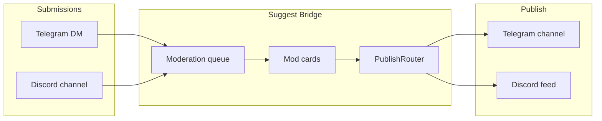

<p align="center">
  
</p>

# Suggest Bridge

[](https://github.com/noki4angel/suggest-bridge/actions/workflows/ci.yml)
[](LICENSE)
[](https://www.python.org/downloads/)

**Self-hosted community suggest bot** for a Telegram channel and a Discord server: submissions, moderation, publishing, feed mirroring, anti-flood.

Русский: [README.md](README.md)

## Who it is for

- Admins of **Russian-speaking** Telegram channels and Discord servers (UI is RU; docs are bilingual)
- Communities that want **their own** suggest box without SaaS lock-in
- One instance = **one** community (one channel + one server)

## Features

| Feature | Description |
|---------|-------------|
| Submissions | Telegram DMs and Discord (`/suggest`, suggest channel) |
| Moderation | Queue, approve, reject, reply to author, scheduled publish |
| Publishing | Telegram channel and/or Discord feed (dual-publish) |
| Anonymity | Authors can hide their name |
| Mirror | TG ↔ Discord feed sync |
| Server setup | `/setup_suggest`, `/decorate_server` |
| Multi-PC | `/host` + Windows agent for admin workstations |
| Run modes | Telegram-only, Discord-only, or both |

## Architecture



Mock UI examples: [docs/assets/screenshots-mockup.md](docs/assets/screenshots-mockup.md)

## Quick start

### Docker

```bash
git clone https://github.com/noki4angel/suggest-bridge.git
cd suggest-bridge
cp .env.example .env
# fill BOT_TOKEN, DISCORD_TOKEN, ADMIN_IDS, CHANNEL_ID
docker compose up -d
```

See [SETUP.md](SETUP.md) for Discord Developer Portal and BotFather steps.

## Configuration

Copy [`.env.example`](.env.example). Channel names and hashtag default to Russian (`#предложка`) but are overridable via env.

## Support

- [GitHub Issues](https://github.com/noki4angel/suggest-bridge/issues)
- Discord support server — add invite link when available

## License

[MIT](LICENSE)
