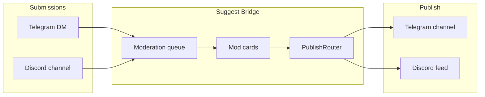

<p align="center">
  
</p>

# Suggest Bridge

[](https://github.com/noki4angel37/suggest-bridge/actions/workflows/ci.yml)
[](LICENSE)
[](https://www.python.org/downloads/)
[](https://discord.gg/F3fBdeTx94)
[](https://github.com/noki4angel37/suggest-bridge/wiki)

**Self-hosted community platform for Telegram ↔ Discord:** suggest flow, cross-platform bridge, pass requests, and other modules on one core. One process, shared moderation queue, dual-publish and feed mirroring.

Русский: [README.md](README.md) · **Docs:** [Wiki](https://github.com/noki4angel37/suggest-bridge/wiki)

---

## What it is

**Suggest Bridge** is a modular platform for your Telegram channel and Discord server. Core `bot/core/` (SQLite, `EventBus`, services) and aiogram + discord.py adapters run in one process. Built-in modules can be extended with your own via `SB_MODULES` (see wiki [[Модули]]).

| Module | What it does |
|--------|--------------|
| **Suggest** | Member submissions → moderation → publish to `#предложка` / TG channel |
| **TG↔DS bridge** | Dual-publish and feed mirroring between platforms |
| **Moderation** | Shared queue, mod cards, approve/reject/schedule, antiflood, blocklist |
| **Also** | Pass requests, casino mini-games, Multi-PC `/host`, operator audit |

Typical suggest flow: a member DMs the bot or uses `/suggest` — moderators review the card, approve or reject, and the post goes to Telegram and/or Discord. Anonymity, scheduled publishing, and feed mirroring are built in.

| Role | What they do |
|------|----------------|
| **Member** | Sends text (≤400 chars) and media via Telegram or Discord |
| **Moderator** | Approves, rejects, replies to author, schedules publish time |
| **Admin** | Deploys the bot, configures tokens and channels |

---

## For community members

No tokens or installation — just the Telegram bot or Discord server.

1. **Telegram:** DM the bot → `/start` → text → choose anonymous or named → submit for moderation.
2. **Discord:** `/suggest` or post in the suggest channel → confirm in bot DMs.

More in the Wiki: **[How to submit](https://github.com/noki4angel37/suggest-bridge/wiki/Как-отправить-заявку)** · [Member FAQ](https://github.com/noki4angel37/suggest-bridge/wiki/FAQ-подписчиков) · **[Discord](https://discord.gg/F3fBdeTx94)**

---

## For administrators

### Who it is for

- Admins of **Russian-speaking** Telegram channels and Discord servers (UI is RU; docs are bilingual)
- Communities that want **their own** TG↔DS platform without SaaS lock-in (suggest is one module)
- One instance = **one** community (one channel + one server)

### Features

| Feature | Description |
|---------|-------------|
| Modules | Built-in: suggest, bridge, moderation, pass, casino; custom via `SB_MODULES` |
| Submissions | Telegram DMs and Discord (`/suggest`, suggest channel) |
| Moderation | Queue, approve, reject, reply to author, scheduled publish |
| Publishing | Telegram channel and/or Discord feed (dual-publish) |
| Anonymity | Authors can hide their name |
| Mirror | TG ↔ Discord feed sync |
| Server setup | `/setup_suggest`, `/setup_pass`, `/decorate_server` |
| Multi-PC | `/host` + Windows agent for admin workstations |
| Run modes | Telegram-only, Discord-only, or both |

### Architecture



Mock UI examples: [docs/assets/screenshots-mockup.md](docs/assets/screenshots-mockup.md)

### Quick start

#### Docker

```bash
git clone https://github.com/noki4angel37/suggest-bridge.git
cd suggest-bridge
bash scripts/deploy/prepare-env.sh
# fill BOT_TOKEN, DISCORD_TOKEN, ADMIN_IDS, CHANNEL_ID in .env
docker compose up -d
```

See [SETUP.md](SETUP.md) for Discord Developer Portal and BotFather steps.

---

## Documentation

| Document | Audience |
|----------|----------|
| **[Wiki](https://github.com/noki4angel37/suggest-bridge/wiki)** | All docs: members and operators |
| [Modules](https://github.com/noki4angel37/suggest-bridge/wiki/Модули) | Built-in modules and `SB_MODULES` |
| [Add a module](https://github.com/noki4angel37/suggest-bridge/wiki/Добавить-модуль) | Third-party module author guide |
| [How to submit](https://github.com/noki4angel37/suggest-bridge/wiki/Как-отправить-заявку) | Members |
| [SETUP.md](SETUP.md) | Install from scratch |
| [SECURITY.md](SECURITY.md) | Report vulnerabilities |
| [CHANGELOG.md](CHANGELOG.md) | Release history |

---

## Support

- **[Discord](https://discord.gg/F3fBdeTx94)** — questions, news, install help
- [GitHub Issues](https://github.com/noki4angel37/suggest-bridge/issues) — bugs and ideas (no tokens in reports)

## License

[MIT](LICENSE)
