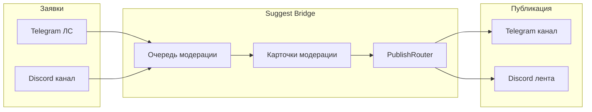

<p align="center">
  
</p>

# Suggest Bridge

[](https://github.com/noki4angel37/suggest-bridge/actions/workflows/ci.yml)
[](LICENSE)
[](https://www.python.org/downloads/)

**Self-hosted бот предложки** для Telegram-канала и Discord-сервера: заявки от подписчиков, модерация, публикация, зеркало ленты, антифlood.

English: [README.en.md](README.en.md)

## Для кого

- Админы **русскоязычных** Telegram-каналов и Discord-серверов
- Сообщества, которым нужна **своя** предложка без SaaS и без привязки к одному хостингу
- Один экземпляр = **одно** сообщество (канал + сервер)

## Возможности

| Функция | Описание |
|---------|----------|
| Заявки | Telegram ЛС и Discord (`/suggest`, канал заявок) |
| Модерация | Очередь, одобрение, отклонение, ответ автору, отложенная публикация |
| Публикация | Telegram-канал и/или Discord `#предложка` (dual-publish) |
| Анонимность | Автор может скрыть имя |
| Зеркало | Синхронизация ленты TG ↔ Discord |
| Настройка сервера | `/setup_suggest`, `/decorate_server` (категории, ACL, emoji┃имена) |
| Multi-PC | `/host` + Windows-агент для нескольких ПК админов |
| Режимы | Только TG, только Discord, или оба |

## Как это работает



Примеры UI (вымышленные данные): [docs/assets/screenshots-mockup.md](docs/assets/screenshots-mockup.md)

## Быстрый старт (5 минут)

### Docker (Linux / VPS)

```bash
git clone https://github.com/noki4angel37/suggest-bridge.git
cd suggest-bridge
cp .env.example .env
# заполните BOT_TOKEN, DISCORD_TOKEN, ADMIN_IDS, CHANNEL_ID
docker compose up -d
```

### Windows

1. Скачайте zip из [Releases](https://github.com/noki4angel37/suggest-bridge/releases)
2. Распакуйте → `Copy-Item .env.example .env` → заполните токены
3. `python -m venv .venv` → `.\.venv\Scripts\pip install -r requirements.txt`
4. `.\.venv\Scripts\python.exe -m bot.main`

Подробнее: [SETUP.md](SETUP.md)

## Конфигурация

Скопируйте [`.env.example`](.env.example). Основные переменные:

| Переменная | Назначение |
|------------|------------|
| `BOT_TOKEN` | Telegram BotFather |
| `ADMIN_IDS` | Telegram id админов через запятую |
| `CHANNEL_ID` | Id канала публикации (`-100…`) |
| `DISCORD_TOKEN` | Discord bot token |
| `OWNER_DISCORD_ID` | Супер-админ Discord (обязателен в DS-only) |

Имена каналов и хэштег настраиваются (`SUGGEST_HASHTAG`, `SETUP_PUBLISH_CHANNEL_NAME`, …) — по умолчанию русские `#предложка`, `ПРЕДЛОЖКИ`.

## Поддержка

- [GitHub Issues](https://github.com/noki4angel37/suggest-bridge/issues) — баги и идеи
- Discord — создайте сервер поддержки и добавьте инвайт в README (см. CONTRIBUTING)

## Лицензия

[MIT](LICENSE) · см. [CHANGELOG](CHANGELOG.md), [SECURITY](SECURITY.md)
