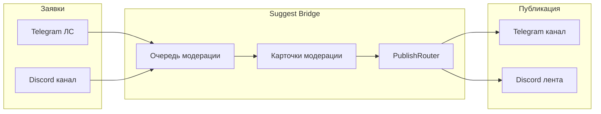

<p align="center">
  
</p>

# Suggest Bridge

[](https://github.com/noki4angel37/suggest-bridge/actions/workflows/ci.yml)
[](LICENSE)
[](https://www.python.org/downloads/)
[](https://discord.gg/F3fBdeTx94)
[](https://github.com/noki4angel37/suggest-bridge/wiki)

**Self-hosted платформа сообщества Telegram ↔ Discord:** предложка, мост, проходка и другие модули на одном ядре. Один процесс, общая очередь модерации, dual-publish и зеркало ленты между платформами.

English: [README.en.md](README.en.md) · **Документация:** [Wiki](https://github.com/noki4angel37/suggest-bridge/wiki)

---

## Что это

**Suggest Bridge** — модульная платформа для своего Telegram-канала и Discord-сервера. Ядро `bot/core/` (SQLite, `EventBus`, сервисы) и адаптеры aiogram + discord.py работают в одном процессе. Встроенные модули можно дополнять своими через `SB_MODULES` (см. wiki [[Модули]]).

| Модуль | Что делает |
|--------|------------|
| **Предложка** | Заявки от участников → модерация → публикация в `#предложка` / TG-канал |
| **Мост TG↔DS** | Dual-publish и зеркало ленты между платформами |
| **Модерация** | Общая очередь, карточки, approve/reject/schedule, антифlood, чёрный список |
| **Также** | Проходка, казино, Multi-PC `/host`, operator audit |

Типичный сценарий предложки: подписчик пишет боту или `/suggest` на сервере — модераторы видят карточку, одобряют или отклоняют, пост выходит в Telegram и/или Discord. Анонимность, отложенная публикация и зеркало ленты — встроены.

| Кто | Что делает |
|-----|------------|
| **Подписчик** | Отправляет текст (≤400 символов) и медиа через Telegram или Discord |
| **Модератор** | Одобряет, отклоняет, отвечает автору, планирует время публикации |
| **Администратор** | Разворачивает бота, настраивает токены и каналы |

---

## Для подписчиков

Не нужны токены и установка — только бот в Telegram или сервер в Discord.

1. **Telegram:** личка боту → `/start` → текст → кнопки «анонимно / с именем» → «отправить на модерацию».
2. **Discord:** `/suggest` или сообщение в канал заявок → подтверждение в ЛС бота.

Подробнее в Wiki: **[Как отправить заявку](https://github.com/noki4angel37/suggest-bridge/wiki/Как-отправить-заявку)** · [FAQ для подписчиков](https://github.com/noki4angel37/suggest-bridge/wiki/FAQ-подписчиков) · **[Discord](https://discord.gg/F3fBdeTx94)**

---

## Для администраторов

### Для кого

- Админы **русскоязычных** Telegram-каналов и Discord-серверов
- Сообщества, которым нужна **своя** платформа TG↔DS без SaaS (предложка — один из модулей)
- Один экземпляр = **одно** сообщество (канал + сервер)

### Возможности

| Функция | Описание |
|---------|----------|
| Модули | Встроенные: предложка, мост, модерация, проходка, казино; свои — через `SB_MODULES` |
| Заявки | Telegram ЛС и Discord (`/suggest`, канал заявок) |
| Модерация | Очередь, одобрение, отклонение, ответ автору, отложенная публикация |
| Публикация | Telegram-канал и/или Discord `#предложка` (dual-publish) |
| Анонимность | Автор может скрыть имя |
| Зеркало | Синхронизация ленты TG ↔ Discord |
| Настройка сервера | `/setup_suggest`, `/setup_pass`, `/decorate_server` (категории, ACL, emoji┃имена) |
| Multi-PC | `/host` + Windows-агент для нескольких ПК админов |
| Operator audit | JSONL `data/events.jsonl` (bridge mode); `SUGGEST_EVENT_LOG` overrides path |
| Режимы | Только TG, только Discord, или оба |

### Как это работает



Примеры UI (вымышленные данные): [docs/assets/screenshots-mockup.md](docs/assets/screenshots-mockup.md)

### Быстрый старт (5 минут)

#### Docker (Linux / VPS)

```bash
git clone https://github.com/noki4angel37/suggest-bridge.git
cd suggest-bridge
bash scripts/deploy/prepare-env.sh   # или .\scripts\deploy\prepare-env.ps1
# отредактируйте .env — токены BotFather / Discord
docker compose up -d
```

#### Windows

1. Скачайте zip из [Releases](https://github.com/noki4angel37/suggest-bridge/releases)
2. Распакуйте → `Copy-Item .env.example .env` → заполните токены
3. `python -m venv .venv` → `.\.venv\Scripts\pip install -r requirements.txt`
4. `.\.venv\Scripts\python.exe -m bot.main`

### Конфигурация

Скопируйте [`.env.example`](.env.example). Основные переменные:

| Переменная | Назначение |
|------------|------------|
| `BOT_TOKEN` | Telegram BotFather |
| `ADMIN_IDS` | Telegram id админов через запятую |
| `CHANNEL_ID` | Id канала публикации (`-100…`) |
| `DISCORD_TOKEN` | Discord bot token |
| `OWNER_DISCORD_ID` | Супер-админ Discord (обязателен в DS-only) |
| `HOST_SYNC_SECRET` | Multi-PC / агент (один секрет на все ПК) |
| `HEALTH_PORT` | HTTP `/healthz` (Docker: `8080`) |

Имена каналов и хэштег настраиваются (`SUGGEST_HASHTAG`, `SETUP_PUBLISH_CHANNEL_NAME`, …) — по умолчанию русские `#предложка`, `ПРЕДЛОЖКИ`.

---

## Документация

| Документ | Для кого |
|----------|----------|
| **[Wiki](https://github.com/noki4angel37/suggest-bridge/wiki)** | Вся документация: подписчики и операторы |
| [Модули](https://github.com/noki4angel37/suggest-bridge/wiki/Модули) | Встроенные модули и `SB_MODULES` |
| [Добавить модуль](https://github.com/noki4angel37/suggest-bridge/wiki/Добавить-модуль) | Автор стороннего модуля |
| [Как отправить заявку](https://github.com/noki4angel37/suggest-bridge/wiki/Как-отправить-заявку) | Подписчики |
| [SETUP.md](SETUP.md) | Установка с нуля (Docker, Windows, systemd) |
| [SECURITY.md](SECURITY.md) | Сообщить об уязвимости |
| [CHANGELOG.md](CHANGELOG.md) | История версий |

---

## Поддержка

- **[Discord](https://discord.gg/F3fBdeTx94)** — вопросы, новости, помощь с установкой
- [GitHub Issues](https://github.com/noki4angel37/suggest-bridge/issues) — баги и идеи (без токенов в описании)

## Лицензия

[MIT](LICENSE) · см. [CHANGELOG](CHANGELOG.md), [SECURITY](SECURITY.md)
