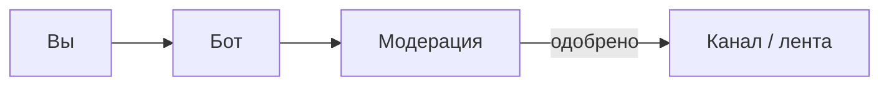

# Suggest Bridge

**Suggest Bridge** — бот, через который подписчики отправляют идеи и предложения в сообщество. Текст проходит модерацию, и одобренное публикуется в Telegram-канале и/или на Discord-сервере.

{: .fs-6 .fw-300 }
Подписчикам не нужны токены, серверы и настройки — достаточно написать боту или воспользоваться командой на Discord.

---

## Как это работает

1. **Вы отправляете** текст или медиа (до 400 символов в подписи).
2. **Модераторы проверяют** заявку в очереди — могут одобрить, отклонить или попросить уточнение.
3. **Одобренное публикуется** в канале или ленте `#предложка` — с вашим именем или анонимно, как вы выбрали.

---

## Быстрые ссылки

| Куда | Зачем |
|------|-------|
| [Как отправить заявку](user-guide) | Пошагово для Telegram и Discord |
| [Discord-сервер](community) | Общение, новости, поддержка |
| [Вопросы и ответы](faq) | Частые вопросы подписчиков |
| [GitHub — README](https://github.com/noki4angel37/suggest-bridge#readme) | Обзор проекта и установка для администраторов |

[Присоединиться к Discord →](https://discord.gg/F3fBdeTx94){: .btn .btn-primary }

---

## Хочу поставить бота у себя

Suggest Bridge — **self-hosted**: администратор сообщества разворачивает бота на своём ПК, VPS или в Docker. Это не облачный сервис с регистрацией.

| Документ | Для кого |
|----------|----------|
| [README на GitHub](https://github.com/noki4angel37/suggest-bridge#readme) | Краткий обзор и быстрый старт |
| [SETUP.md](https://github.com/noki4angel37/suggest-bridge/blob/main/SETUP.md) | Установка с нуля |
| [Wiki (операторы)](https://github.com/noki4angel37/suggest-bridge/wiki) | Полный справочник: команды, деплой, инциденты |

English overview: [README.en.md](https://github.com/noki4angel37/suggest-bridge/blob/main/README.en.md)
