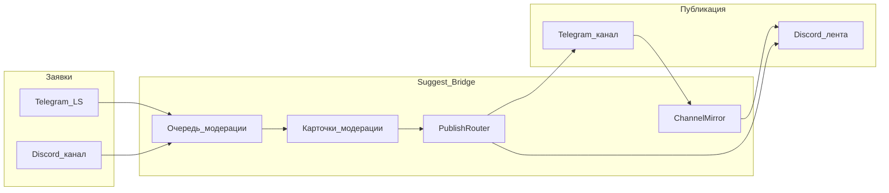

# Архитектура

Один процесс `python -m bot.main` поднимает Telegram (aiogram 3), Discord (discord.py) и планировщик отложенных публикаций — в зависимости от режима. Общее ядро: `bot/core/` (правила, сервисы, SQLite, PublishRouter, host lease).

## Поток данных



Публикации из модерации **не** дублируются зеркалом: перед Discord-стороной пишется mirror stub (`kind=suggest_publish`), чтобы лента не задвоила пост.

## Структура кода

| Путь | Назначение |
|------|------------|
| `bot/main.py` | Точка входа |
| `bot/bridge.py` | Composition root: TG + DS + scheduler + lease |
| `bot/config.py` | Загрузка `.env` / `local.env`, `detect_run_mode` |
| `bot/core/` | SQLite, сервисы, PublishRouter, scheduler, host lease/sync |
| `bot/adapters/telegram/` | aiogram: заявки, модерация, настройки, host |
| `bot/adapters/discord/` | discord.py: suggest, модерация, mirror, setup, admin; sync слэш-команд на гильдию |
| `bot/agent.py` | Windows-агент (multi-PC) |
| `bot/health.py` | HTTP `GET /healthz` |
| `data/bridge.db` | SQLite (заявки, админы, mirror_links, settings) |

## Режимы запуска

`detect_run_mode()` смотрит на токены:

| Токены | Режим |
|--------|-------|
| `BOT_TOKEN` + `DISCORD_TOKEN` | `both` |
| только `BOT_TOKEN` (+ `ADMIN_IDS`, `CHANNEL_ID`) | `telegram_only` |
| только `DISCORD_TOKEN` (+ **`OWNER_DISCORD_ID`**) | `discord_only` |

В `telegram_only` Discord-паблишер не подключается: цель `both` на карточке фактически публикует только в Telegram.

## FSM и рестарт

Telegram Dispatcher использует **MemoryStorage**:

- черновики пользователя;
- шаги админа «ответ автору» / «причина отклонения»

**не переживают рестарт** процесса. После рестарта действие нужно начать снова с карточки. Шаг ответа/отклонения истекает через **15 минут** без активности (`REPLY_FSM_TTL_SEC = 900`).

## Dual-publish и rollback

`PublishRouter` публикует в TG и/или DS по `publish_target`. При ошибке второй стороны уже опубликованное удаляется (включая все message id альбома в Telegram), mirror stubs очищаются, ошибка пробрасывается. Ретраи: до 2 с задержкой ~0.5 с.

## Multi-PC (кратко)

Один primary держит Telegram long polling и lease в БД. Остальные — агенты + Syncthing на `HOST_SYNC_DIR`. Команды подписаны HMAC (`HOST_SYNC_SECRET`). Подробнее: [[Multi-PC]].

## Health

При `HEALTH_PORT` (положительное целое) слушается **`0.0.0.0:PORT`**, путь `/healthz` (не только localhost):

```json
{"status":"ok","checks":{"telegram":true,"discord":true,"lease":true}}
```

- HTTP **200** — `status == "ok"`
- HTTP **503** — `degraded` (платформа ещё не готова)

Без aiohttp health отключается с предупреждением в лог. Ограничение доступа снаружи: [[Безопасность]], [[Деплой]].
