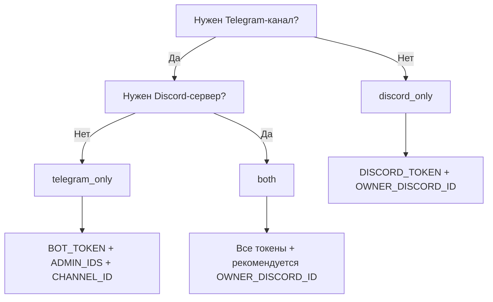

# Выбор режима

Suggest Bridge определяет режим **автоматически** по токенам в `.env`: заданы оба → `both`; только Telegram → `telegram_only`; только Discord → `discord_only`. Подробная таблица переменных — [[Конфигурация]]; FAQ — [[FAQ]].

> Литерал `REPLACE_ME` в значении токена ≡ «не задано». Для `OWNER_DISCORD_ID` в discord-only **не** оставляйте `REPLACE_ME` — укажите id или не используйте discord-only.

## Сводная таблица

| Переменная | TG-only | DS-only | Both |
|------------|:-------:|:-------:|:----:|
| `BOT_TOKEN` | **да** | — | **да** |
| `ADMIN_IDS` | **да** | — | **да** |
| `CHANNEL_ID` | **да** | — | **да** |
| `DISCORD_TOKEN` | — | **да** | **да** |
| `OWNER_DISCORD_ID` | — | **да** | рекомендуется |
| `OWNER_TELEGRAM_ID` | опц. | — | опц. |
| `HEALTH_PORT` | рекоменд. | рекоменд. | рекоменд. |
| `BRIDGE_DB_PATH` | опц. | опц. | опц. |
| `SETUP_*` (имена каналов DS) | — | опц. | опц. |
| `HOST_SYNC_SECRET` + агент | только multi-PC | только multi-PC | только multi-PC |

Пример `.env` по режимам — [.env.example](https://github.com/noki4angel37/suggest-bridge/blob/main/.env.example).

## Telegram only (`telegram_only`)

**Когда выбирать**

- Сообщество живёт только в Telegram-канале, Discord не нужен.
- Хотите минимальный footprint: один токен, long polling, без guild setup.

**Обязательно**

```
BOT_TOKEN=...
ADMIN_IDS=123456789
CHANNEL_ID=-100...
```

`DISCORD_TOKEN` — не задавайте или оставьте закомментированным / пустым (не `REPLACE_ME` в активной строке, если скрипт подставляет его обратно).

**Что работает**

- Заявки в личку боту → очередь → публикация в TG-канал.
- Модерация в личке админов (`ADMIN_IDS`).
- Команды `/start`, `/queue`, `/mirror off` (зеркало DS не применимо).

**Ограничения**

- Нет Discord inbox, `/suggest`, `/setup_suggest`.
- Нет зеркала TG ↔ DS.
- Multi-guild Discord не актуален.

Дальше: [[Telegram]], [[Первый-запуск]].

## Discord only (`discord_only`)

**Когда выбирать**

- Сервер Discord — единственная площадка; Telegram-канала нет.
- Модераторы работают в Discord (карточки, slash-команды).

**Обязательно**

```
DISCORD_TOKEN=...
OWNER_DISCORD_ID=123456789012345678
```

`BOT_TOKEN`, `ADMIN_IDS`, `CHANNEL_ID` — **не нужны**.

**Что работает**

- `/suggest` и канал `#посты-предложения`.
- `/setup_suggest`, `/decorate_server` — [[Схема-каналов-Discord]].
- Модерация и публикация в `#предложка`.
- Bootstrap админа бота через `OWNER_DISCORD_ID`.

**Ограничения**

- Нет TG-канала и лички @BotFather-пути для авторов.
- `OWNER_DISCORD_ID` **обязателен** — без него процесс не стартует.
- Команды TG (`/mirror`, `/host` в Telegram) недоступны — multi-PC через Discord `/host` и агент.

Дальше: [[Discord]], [[Первый-запуск]].

## Both (`both`)

**Когда выбирать**

- Одно сообщество в **TG-канале и Discord-guild** одновременно.
- Нужна **одна очередь** модерации и выбор цели публикации (TG / DS / both).
- Нужно **зеркало ленты** между TG-каналом и `#предложка`.

**Обязательно**

```
BOT_TOKEN=...
ADMIN_IDS=...
CHANNEL_ID=...
DISCORD_TOKEN=...
OWNER_DISCORD_ID=...   # настоятельно рекомендуется
```

**Что работает**

- Заявки из Telegram **и** Discord в общую очередь.
- Модератор может решать с любой платформы; карточки синхронизируются.
- `PublishRouter`: публикация в TG, DS или обе стороны с rollback при ошибке — [[Модерация]].
- Зеркало ленты: `/mirror on|off` в Telegram — [[Модерация#Зеркало-ленты]].
- Discord → карточки TG-админам в личку.

**Ограничения и нюансы**

| Тема | Деталь |
|------|--------|
| Масштаб | Рекомендуется **1 TG-канал + 1 DS guild** на инстанс — [[FAQ]] |
| TG → DS карточки | Заявки из Telegram **не** зеркалятся карточками в Discord при **нескольких guild** (нет однозначного guild) — [[Telegram#Важные-ограничения]] |
| DS → TG карточки | Работает: DS-заявки видны TG-админам |
| Черновики TG | MemoryStorage — не переживают рестарт процесса |
| Health | В `checks` ожидайте `telegram` и `discord` |
| Invite DS | Права **268561488** обязательны для setup — [[Discord]] |

**Рекомендуемый сценарий both**

1. Заполнить все токены и id — [[Конфигурация]].
2. Поднять процесс — [[Быстрый-старт]].
3. `/setup_suggest` на guild → smoke-test обеих платформ — [[Первый-запуск]].
4. Проверить `/mirror` после первой публикации.

## Блок-схема выбора



## Смена режима

1. Остановите процесс (один primary).
2. Отредактируйте `.env` / `/etc/suggest-bridge/env` — добавьте или уберите токены.
3. Перезапустите; проверьте `curl …/healthz` — поля `checks` соответствуют режиму.
4. При переходе на DS-only выполните `/setup_suggest`, если guild ещё не настроен.
5. База `bridge.db` сохраняет очередь; смена режима не переносит уже опубликованные посты на новую платформу автоматически.

Проблемы при старте — [[Устранение-неисправностей]].
