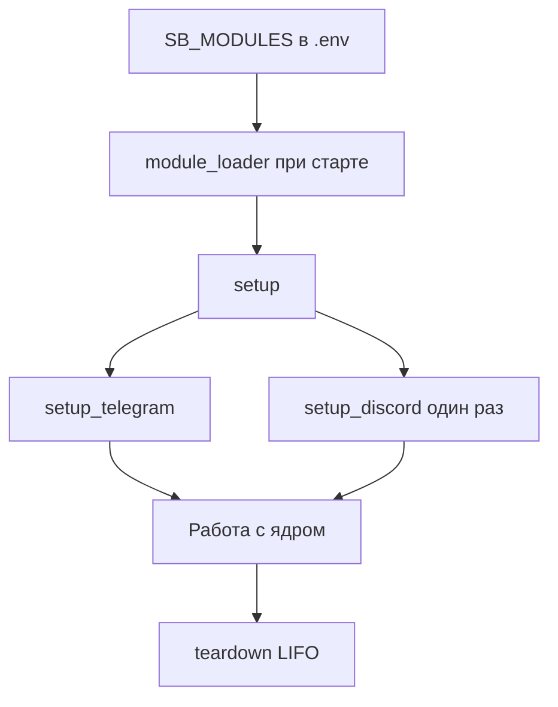

# Добавить модуль

Руководство для авторов **сторонних** модулей Suggest Bridge. Не нужно править ядро и не нужно открывать PR в этот репозиторий: достаточно класса в файле **на вашей машине** и записи в `SB_MODULES`.

English: [[Add-module-en]] · Troubleshooting: [[FAQ-модулей]] · [[Module-FAQ-en]] · Обзор API: [[Модули]]

## Быстрый старт (шаблон)

Скопируйте минимальный модуль **вне** репозитория или сгенерируйте файл:

```powershell
.\scripts\modules\scaffold-local-module.ps1 -OutDir C:\path\to\modules
```

```bash
bash scripts/modules/scaffold-local-module.sh ~/suggest-bridge-modules
```

Шаблон в репозитории: `examples/local_module_template/hello_module.py` (только образец, не место для вашего кода).

## Главный путь: файл на диске + `SB_MODULES`

1. Сохраните `.py` у себя (не в GitHub Suggest Bridge).
2. Укажите его в `.env`.
3. Проверьте загрузку без полного запуска: `python -m bot.core.module_loader` (ошибка пути или класса — исправьте до рестарта).
4. Перезапустите процесс бота (`python -m bot.main`, Docker `compose restart`, systemd — тот же unit, что поднимает бота).
5. Убедитесь, что модуль поднялся: `curl -s http://127.0.0.1:8080/healthz` → в JSON поле `checks.modules` должно быть `true`. При отладке можно включить `SB_MODULES_STRICT=1`, чтобы процесс не стартовал с битой записью.

Путь к `.py`: сначала от **корня клона** suggest-bridge, иначе абсолютный путь на вашей машине (см. [[Модули]]).

```python
from bot.core.modules import BaseBridgeModule, ModuleContext

class HelloModule(BaseBridgeModule):
    name = "hello"

    async def setup(self, ctx: ModuleContext) -> None:
        ctx.logger.info("hello module loaded")
```

```env
SB_MODULES=/opt/my-bot/modules/hello.py:HelloModule
```

Windows:

```env
SB_MODULES=C:\path\to\hello.py:HelloModule
```

Несколько модулей:

```env
SB_MODULES=/opt/modules/a.py:ModuleA,/opt/modules/b.py:ModuleB
```

## Жизненный цикл модуля



| Этап | Где смотреть |
|------|----------------|
| Загрузка | `python -m bot.core.module_loader`, лог `Loaded module …` |
| Ошибка spec | лог `Failed to load SB_MODULES`, exit 1 у validate CLI |
| После старта | `GET /healthz` → `checks.modules` |
| Strict | `SB_MODULES_STRICT=1` — не стартуем, если spec битый |

## Telegram

В `setup_telegram` зарегистрируйте aiogram `Router`:

```python
from aiogram import Router
from aiogram.filters import Command
from aiogram.types import Message

async def setup_telegram(self, ctx: ModuleContext) -> None:
    if ctx.dp is None:
        return
    router = Router(name="hello")

    @router.message(Command("hello"))
    async def hello(message: Message) -> None:
        await message.answer("Hello from module")

    ctx.dp.include_router(router)
```

## Discord

В `setup_discord` добавьте slash-команды **до** глобального sync (платформа вызывает хук в `setup_hook`):

```python
import discord
from discord import app_commands

async def setup_discord(self, ctx: ModuleContext) -> None:
    bot = ctx.discord_bot
    if bot is None:
        return

    @app_commands.command(name="hello_module", description="Hello from module")
    async def hello_module(interaction: discord.Interaction) -> None:
        await interaction.response.send_message("Hello", ephemeral=True)

    bot.tree.add_command(hello_module)
```

Для Cogs используйте `await bot.add_cog(MyCog(bot, ctx.discord_ctx))` — в `discord_ctx` есть `publish`, `guild_config`, проверки админа.

## Доступ к данным

- **БД:** `ctx.db` — тот же `BridgeDatabase`, что у предложки. Новые таблицы — отдельная миграция/схема на ваш риск; предпочтительно своя SQLite или внешний сервис.
- **События:** `ctx.bus.subscribe(DomainEventSubclass, handler)` — отпишитесь в `teardown` через `ctx.bus.unsubscribe(...)`. Список событий — `bot/core/models.py`.
- **Сервисы:** `ctx.services` — submissions, moderation, admins и т.д. Не обходите SQL напрямую, если можно через сервис.

## Свой пакет (опционально)

Если хотите делиться кодом с собой или друзьями — выложите его в **свой** GitHub или на PyPI. Это не публикация в upstream Suggest Bridge.

1. Свой репозиторий или пакет — не [noki4angel37/suggest-bridge](https://github.com/noki4angel37/suggest-bridge).
2. Установите в venv бота: `pip install your-package`.
3. В `.env`: `SB_MODULES=your_package.bridge:YourModule`.

Или укажите абсолютный путь к `.py` без установки пакета — этого достаточно для повседневной разработки.

## Этот репозиторий — не место для вашего модуля

Не открывайте PR, который добавляет community-specific модуль или фичу «для нашего сервера» в [suggest-bridge](https://github.com/noki4angel37/suggest-bridge).

PR в этот репозиторий по-прежнему уместны для: багов ядра, документации, правок самого ядра. См. [CONTRIBUTING.md](https://github.com/noki4angel37/suggest-bridge/blob/main/CONTRIBUTING.md).

## Пример в комплекте ядра

`examples/sample_module/module.py` — образец `/sample_ping` в Telegram и Discord. Это пример загрузчика, не шаблон «пришлите свой модуль сюда». Включение для проверки:

```env
SB_MODULES=examples/sample_module/module.py:SampleModule
```

(путь **от корня репозитория** suggest-bridge или абсолютный; см. `python -m bot.core.module_loader`)

## Ограничения MVP

| Есть | Нет (пока) |
|------|------------|
| Allowlist `SB_MODULES` | Отключение встроенных модулей через env |
| Хуки TG + DS | Изоляция sandbox / отдельный процесс |
| Пример + тесты loader | Официальный marketplace модулей |

## Частые проблемы

См. [[FAQ-модулей]] — пути Windows, healthz, Discord slash, несколько модулей.

См. также: [[Модули]] · [[Add-module-en]] · [[Разработка]] · [[Архитектура]]
