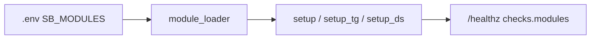

# Модули

**Suggest Bridge** — **открытое ядро** Telegram ↔ Discord: `bot/core/` (БД, `EventBus`, сервисы) и адаптеры Telegram/Discord. Встроенные возможности — комплект ядра (примеры и фичи, которые идут с репозиторием). Свои функции пишут локально и подключают через allowlist `SB_MODULES`. Класть свой модуль в этот GitHub не нужно и не ожидается.

## Встроенные модули (комплект ядра)

| Модуль | Документация | Кратко |
|--------|--------------|--------|
| **Предложка** | [[Как-отправить-заявку]], [[Модерация]] | Заявки → очередь → публикация |
| **Мост TG↔DS** | [[Зеркало-ленты]], [[Архитектура]] | Dual-publish, зеркало ленты |
| **Модерация** | [[Модерация]], [[Антифлуд-и-блокировки]] | Карточки, approve/reject, blocklist |
| **Проходка** | [[Проходка]] | Временная роль через модерацию |
| **Казино** | [[Команды]] | Мини-игры без валюты |
| **Multi-PC** | [[Multi-PC]] | `/host`, lease, Windows-агент |

Это не «равный» слой с вашими расширениями: это то, что уже входит в состав ядра. Встроенные модули **не** отключаются через env в текущей версии — они часть composition root. Сторонний модуль **дополняет** процесс, не заменяя встроенные.

## Подключение своих модулей (`SB_MODULES`)

Свой код живёт **на вашей машине** (или в пакете, который вы ставите себе сами). В официальный репозиторий [suggest-bridge](https://github.com/noki4angel37/suggest-bridge) кастомные фичи и модули сообщества **не** присылают PR-ом.

Переменная окружения **`SB_MODULES`** — список через запятую или с новой строки. Каждая запись:

```text
package.module:ClassName
```

или путь к файлу на диске:

```text
/opt/my-bot/modules/hello.py:MyModule
```

```text
C:\path\to\hello.py:MyModule
```

Пример локального подключения:

```env
SB_MODULES=/opt/my-bot/modules/hello.py:HelloModule
```

Пример из комплекта ядра (только чтобы проверить загрузчик):

```env
SB_MODULES=examples/sample_module/module.py:SampleModule
```

После изменения `.env` перезапустите процесс бота.

| Правило | Зачем |
|---------|-------|
| Только явный allowlist | Нет автоскана site-packages |
| Ошибка одного модуля | Лог + остальные модули и встроенные фичи работают |
| `setup_discord` один раз | Повторное подключение Discord не дублирует хуки |
| Относительный путь к `.py` | Сначала от корня репозитория, затем от CWD процесса |
| Discord slash | Регистрируйте команды в `setup_discord` — sync вызывается ядром |
| `/healthz` | Поле `checks.modules` = false при сбое загрузки или hook |
| `SB_MODULES_STRICT=1` | Процесс не стартует, если хотя бы одна запись не загрузилась |

Проверка без запуска бота:

```bash
python -m bot.core.module_loader
```

Подробнее для авторов: [[Добавить-модуль]] · [[Add-module-en]] · [[FAQ-модулей]].

## Жизненный цикл



## API (кратко)

Класс модуля наследует `BaseBridgeModule` из `bot.core.modules`:

| Хук | Когда |
|-----|-------|
| `setup` | Общая инициализация (один раз на процесс) |
| `setup_telegram` | Регистрация aiogram router |
| `setup_discord` | Cogs / `bot.tree.add_command` (**один раз**; не повторяется при reconnect Discord) |
| `teardown` | Остановка процесса (**LIFO**); в ctx есть `discord_bot`, если Discord успел подключиться |

| Поле | Назначение |
|------|------------|
| `config` | `BridgeConfig` из `.env` |
| `db` | Общая SQLite (`BridgeDatabase`) |
| `bus` | `EventBus` — доменные события из `bot/core/models.py` |
| `services` | Submissions, moderation, admins и др. |
| `logger` | Дочерний логгер с именем модуля |
| `telegram_bot` / `dp` | aiogram (если режим TG) |
| `discord_bot` / `discord_ctx` | discord.py + publish/helpers (если режим DS) |

В `teardown` поля Discord заполняются, если модуль успел выполнить `setup_discord`.

Шаблон для копирования: `examples/local_module_template/`. Полный пример: `examples/sample_module/`. Свои модули пишите **вне** этого репозитория.

См. также: [[Архитектура]] · [[Добавить-модуль]] · [[Add-module-en]] · [[FAQ-модулей]] · [[Home]]
